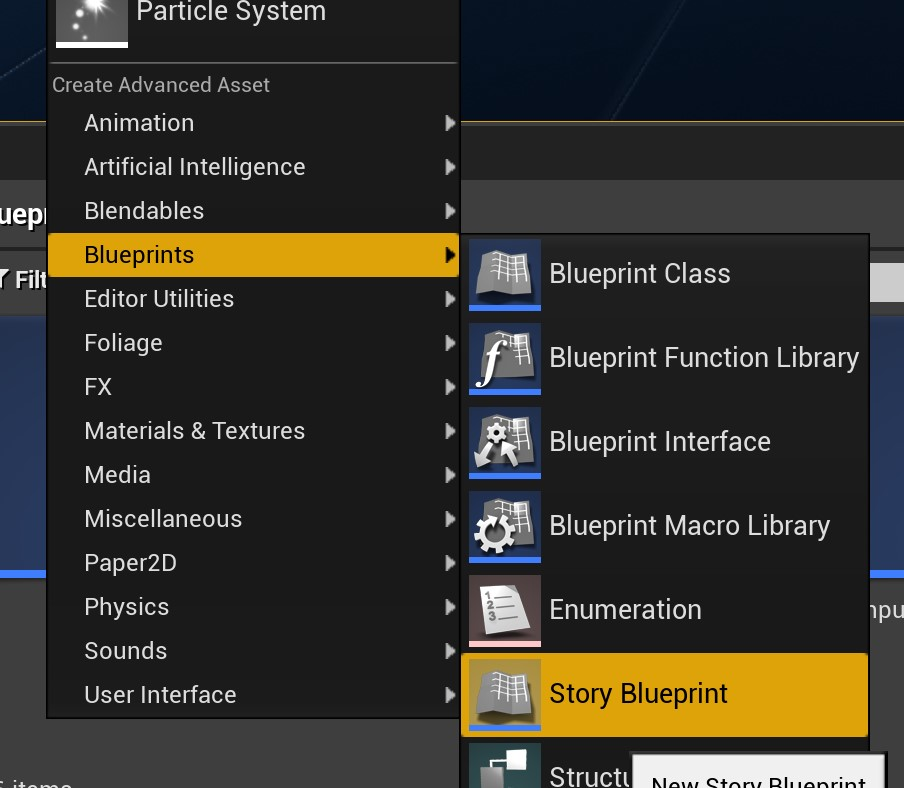
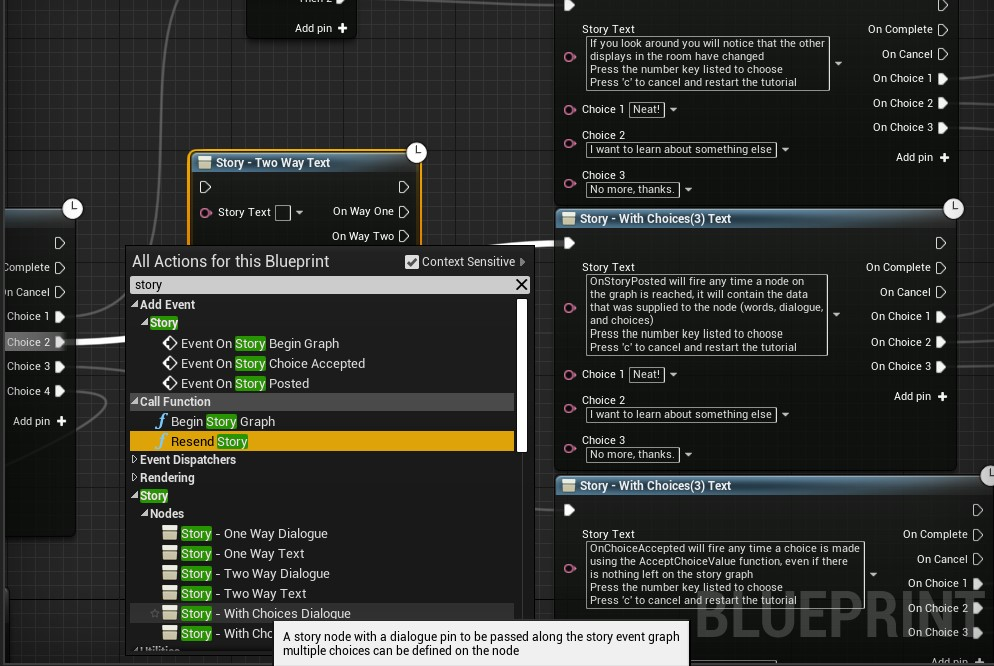
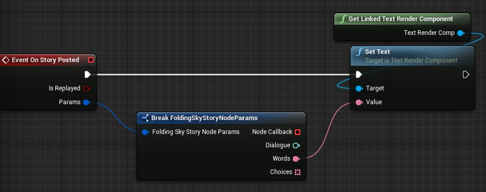

# Folding Sky Story Plugin

The Folding Sky Story Plugin is an additional set of blueprint nodes for narrative flow control being lazily developed in UE 4.26

* Uses standard blueprints familiar to any new UE4 developer
* 6 new powerful blueprint nodes
* An event system for utilization of data arranged on the blueprint graph
* Can use localized text, string tables, or Dialogue Wave assets
* Text based choices allow for narrative style control over blueprint flow

## Usage

0. Know how to use Blueprints, Actors, ActorComponents, and code plugins in UE4. There are many resources available on the internet that
   cover these topics well. I will be glad to field any questions, but answers may involve me pointing to tutorials off topic.
1. Create a Story Blueprint by right cicking the content browser then from the "Create Advanced Asset -> Blueprints" context menu in editor

  

2. Build a graph using "Story Nodes" and supply them with data

  

3. Use the event "On Story Posted" to handle data you have arranged by using story nodes
   This is good for visualization of Text or playing of audio set up in Dialogue Waves

  

4. Devise a way to "drive" your story graph. Calling the Accept Choice Value function will drive the graph of story nodes created in Step 2. 
   Based on the integer input, different paths will be chosen to traverse the graph. Each time a story node is hit, the OnStoryPosted event will be triggered.

  

5. The story blueprint can be placed in world on actors just like any Actor Component